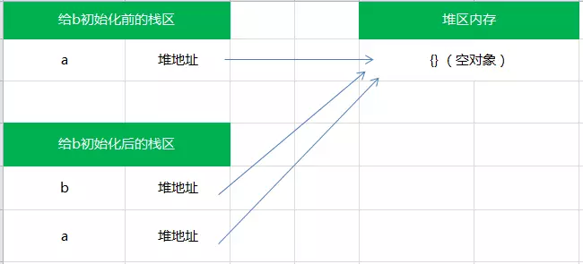

# 堆栈
栈（stack）为自动分配的内存空间，它由系统自动释放；
而堆（heap）则是动态分配的内存，大小不定也不会自动释放。

## 基本数据类型

1. 基本数据类型值不可变
    ```js
    let a = 'abc'
    a[0] = 'c'

    console.log(a) // abc
    ```
2. 基本类型的比较是值的比较
      ```js
      var a = 1;
      var b = 1;
      console.log(a === b);//true
      ```

## 引用类型
引用类型（object）是存放在堆内存中的，变量实际上是一个存放在栈内存的指针，这个指针指向堆内存中的地址。每个空间大小不一样，要根据情况开进行特定的分配，例如。


引用类型的比较是引用的比较
```js
var a = [1,2,3];
var b = [1,2,3];
console.log(a === b); // false
```

## 垃圾回收
引用：在内存管理的环境中，一个对象如果有访问另一个对象的权限（隐式或者显式），叫做一个对象引用另一个对象。例如，一个Javascript对象具有对它原型的引用（隐式引用）和对它属性的引用（显式引用）。

引用计数垃圾收：此算法把“对象是否不再需要”简化定义为“对象有没有其他对象引用到它”。如果没有引用指向该对象（零引用），对象将被垃圾回收机制回收。

标记-清除算法：这个算法假定设置一个叫做根（root）的对象（在Javascript里，根是全局对象）。垃圾回收器将定期从根开始，找所有从根开始引用的对象，然后找这些对象引用的对象……从根开始，垃圾回收器将找到所有可以获得的对象和收集所有不能获得的对象。

限制: 那些无法从根对象查询到的对象都将被清除

## 传值与传址的区别
基本数据类型的赋值（=）是在内存中新开辟一段栈内存，然后再把再将值赋值到新的栈中。
```js
var a = 10;
var b = a;

a ++;
console.log(a); // 11
console.log(b); // 10
```


引用类型的赋值是传址。只是改变指针的指向
```js
var a = {}; // a保存了一个空对象的实例
var b = a;  // a和b都指向了这个空对象

a.name = 'jozo';
console.log(a.name); // 'jozo'
console.log(b.name); // 'jozo'

b.age = 22;
console.log(b.age);// 22
console.log(a.age);// 22

console.log(a == b);// true
```


## 深拷贝与浅拷贝
深拷贝：将 B 对象拷贝到 A 对象中，包括 B 里面的子对象，

浅拷贝：将 B 对象拷贝到 A 对象中，但不包括 B 里面的子对象

```js
    // 内部方法：用户合并一个或多个对象到第一个对象
    // 参数：
    // target 目标对象  对象都合并到target里
    // source 合并对象
    // deep 是否执行深度合并
    function extend(target, source, deep) {
        for (key in source)
            if (deep && (isPlainObject(source[key]) || isArray(source[key]))) {
                // source[key] 是对象，而 target[key] 不是对象， 则 target[key] = {} 初始化一下，否则递归会出错的
                if (isPlainObject(source[key]) && !isPlainObject(target[key]))
                    target[key] = {}

                // source[key] 是数组，而 target[key] 不是数组，则 target[key] = [] 初始化一下，否则递归会出错的
                if (isArray(source[key]) && !isArray(target[key]))
                    target[key] = []
                // 执行递归
                extend(target[key], source[key], deep)
            }
            // 不满足以上条件，说明 source[key] 是一般的值类型，直接赋值给 target 就是了
            else if (source[key] !== undefined) target[key] = source[key]
    }

    // Copy all but undefined properties from one or more
    // objects to the `target` object.
    $.extend = function(target){
        var deep, args = slice.call(arguments, 1);

        //第一个参数为boolean值时，表示是否深度合并
        if (typeof target == 'boolean') {
            deep = target;
            //target取第二个参数
            target = args.shift()
        }
        // 遍历后面的参数，都合并到target上
        args.forEach(function(arg){ extend(target, arg, deep) })
        return target
    }
```

$.extend(true, target, [source, ...])  ⇒ target

将 deep 参数放在首位，方便接收不确定的 source 参数。
核心是用 for...in 遍历对象属性，如需深拷贝则启用**递归**。
